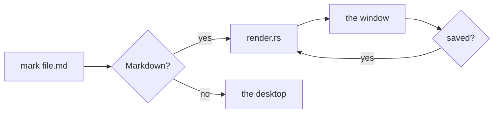
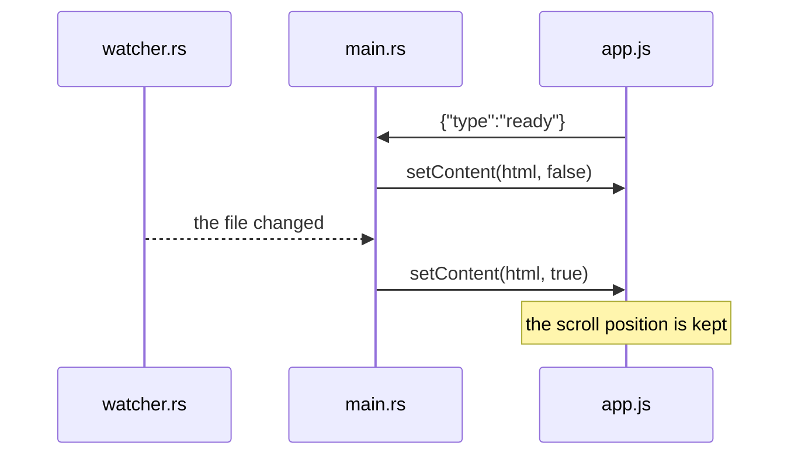
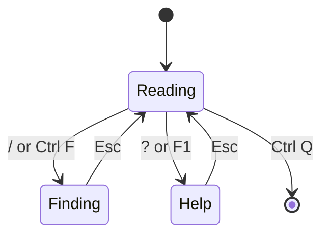
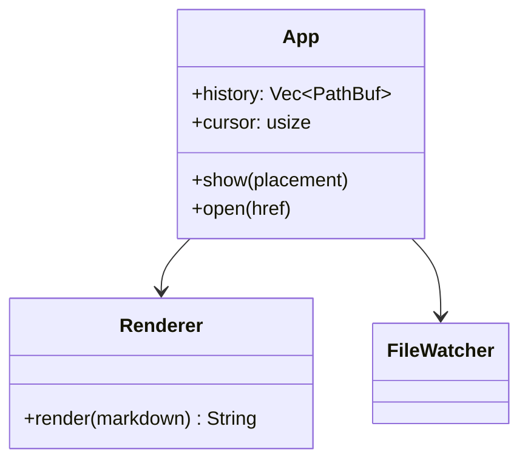
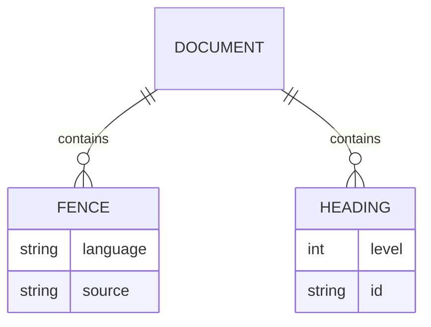
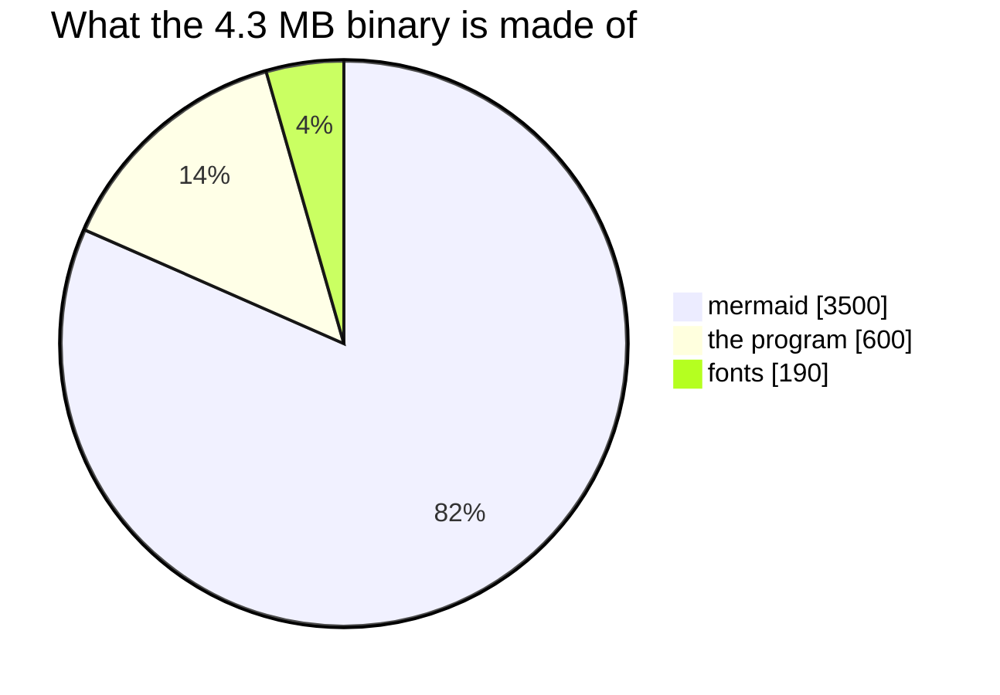
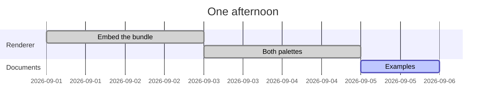

# Diagrams

Back to the [examples](README.md).

A fence marked `mermaid` is drawn where it stands, by a renderer compiled into
the binary — nothing is fetched, and there is nothing to install.

Each diagram is drawn twice, once per palette, and the stylesheet shows one of
them: press <kbd>d</kbd> and they change with the page, with no redraw. Printing
always gets the light one, whichever way the window is set.

## Flowchart

## Sequence

## State

## Class

## Entities

## Pie

## Gantt

## When a diagram will not parse

The source stays where it was, with mermaid's own reason for refusing it above
the block, and the rest of the document renders as usual. There is one in
[links.md](links.md), at the foot.
